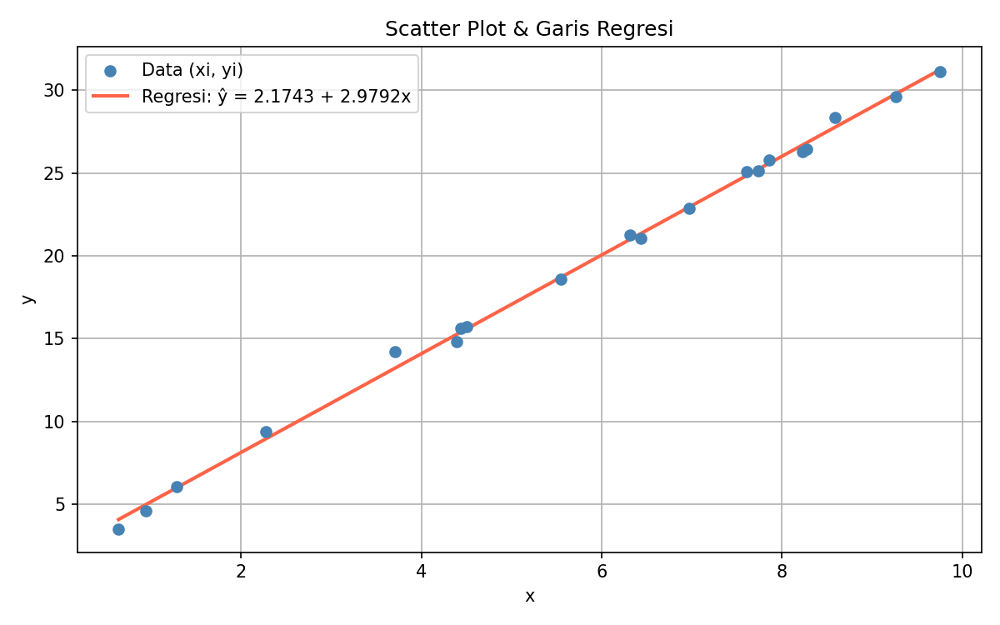
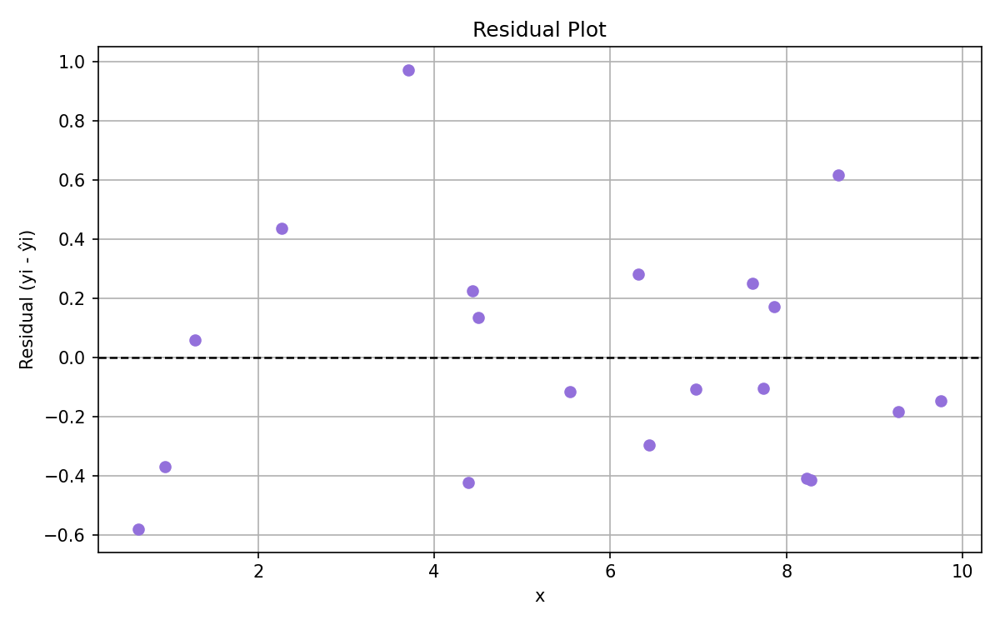

# Mini Project — Least Squares Regression

Implementasi **Least Squares Regression** menggunakan Python untuk menentukan garis regresi terbaik dari sekumpulan data menggunakan pendekatan matriks.

**Mata Kuliah:** Aljabar Linear
**Program Studi:** D3 Teknik Informatika
**Institusi:** Politeknik Negeri Bandung

---

## Deskripsi Project

Project ini bertujuan untuk menerapkan konsep **Regresi Linear Sederhana** dan **Metode Kuadrat Terkecil (Least Squares Method)** yang dipelajari pada mata kuliah Aljabar Linear.

Sebanyak **20 titik data** dibangkitkan secara acak berdasarkan model:

y = 2 + 3x + ε

dengan:

* x : variabel independen
* y : variabel dependen
* ε ~ N(0, 0.5²) : noise acak berdistribusi normal

Parameter regresi dihitung menggunakan Persamaan Normal (Normal Equation):

β̂ = (AᵀA)⁻¹ Aᵀb

Hasil regresi kemudian dievaluasi menggunakan beberapa metrik untuk mengetahui kualitas model.

---

## Tujuan Project

* Memahami konsep Least Squares Regression
* Mengimplementasikan operasi matriks dalam Python
* Menghitung parameter regresi secara numerik
* Mengevaluasi kualitas model menggunakan SSE, TSS, dan R²
* Memvisualisasikan hasil regresi dan residual

---

## Anggota Kelompok

| No | Nama                 | Tanggung Jawab                          |
| -- | -------------------- | --------------------------------------- |
| 1  | Ashila Aulia Salwa   | Data Generation & Perhitungan Matriks   |
| 2  | R. Neysa Rahma Velda | Evaluasi Model (Residual, SSE, TSS, R²) |
| 3  | Rainissa Azizah      | Visualisasi Data & Penyusunan Laporan   |

---

## Struktur Project

```text
mini-project-least-squares/
│
├── data_generation.py
├── matrix_regression.py
├── evaluation.py
├── visualization.py
├── main.py
│
├── output/
│   ├── scatter_regression.png
│   ├── residual_plot.png
│   └── result.txt
│
├── laporan/
│
├── requirements.txt
├── .gitignore
└── README.md
```

## Library yang Digunakan

Project ini menggunakan beberapa library Python:

* numpy
* matplotlib
* pandas

Install seluruh dependency dengan:

```bash
pip install -r requirements.txt
```

## Instalasi

Clone repository:

```bash
git clone <repository-url>
cd mini-project-least-squares
```

Install dependency:

```bash
pip install -r requirements.txt
```

---

## Menjalankan Program

Jalankan program utama:

```bash
python main.py
```

Program akan menjalankan tiga tahap utama:

1. Generate data dan menghitung parameter regresi
2. Mengevaluasi model menggunakan SSE, TSS, dan R²
3. Membuat visualisasi regresi dan residual

### Catatan

Saat program dijalankan, akan muncul **dua jendela visualisasi**:

1. Scatter Plot dan Garis Regresi
2. Residual Plot

Tutup kedua jendela tersebut agar program dapat selesai dijalankan dan terminal kembali aktif.

---

## Output

Program akan menghasilkan beberapa file pada folder `output/`:

| File                   | Deskripsi                          |
| ---------------------- | ---------------------------------- |
| scatter_regression.png | Visualisasi data dan garis regresi |
| residual_plot.png      | Visualisasi residual model         |
| result.txt             | Hasil evaluasi model               |

Contoh isi `result.txt`:

```text
β₀ = 2.1743
β₁ = 2.9792

SSE = 2.9355
TSS = 1368.1301
R²  = 0.9979
```

---

## Konsep yang Digunakan

Project ini mengimplementasikan beberapa konsep Aljabar Linear dan Analisis Data:

* Sistem Persamaan Linear
* Operasi Matriks
* Matrix Multiplication
* Matrix Inverse
* Least Squares Regression
* Residual Analysis
* Sum of Squared Errors (SSE)
* Total Sum of Squares (TSS)
* Coefficient of Determination (R²)
* Data Visualization

---

## Interpretasi Hasil

Berdasarkan hasil pengujian:

```text
SSE = 2.9355
TSS = 1368.1301
R² = 0.9979
```

Nilai R² sebesar **0.9979** menunjukkan bahwa model regresi mampu menjelaskan sekitar **99.79% variasi data**, sehingga model dapat dianggap sangat baik dalam merepresentasikan hubungan antara variabel x dan y.

---

## Visualisasi

### Scatter Plot dan Garis Regresi



### Residual Plot



---

## Lisensi

Project ini dibuat untuk keperluan akademik pada mata kuliah Aljabar Linear, D3 Teknik Informatika, Politeknik Negeri Bandung.
